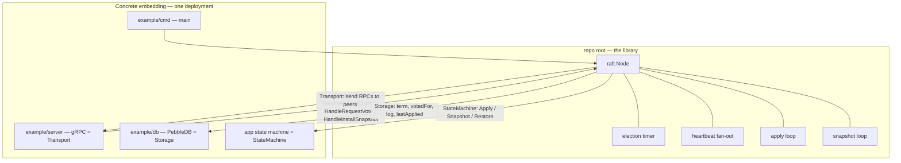
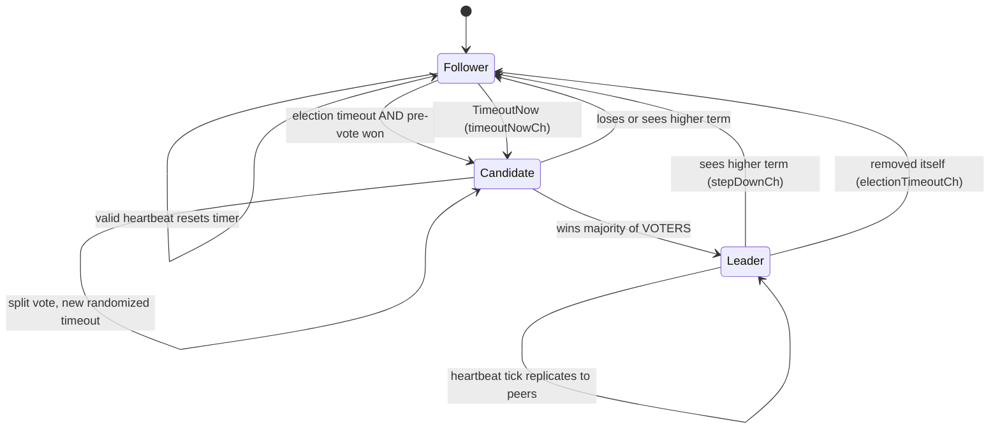
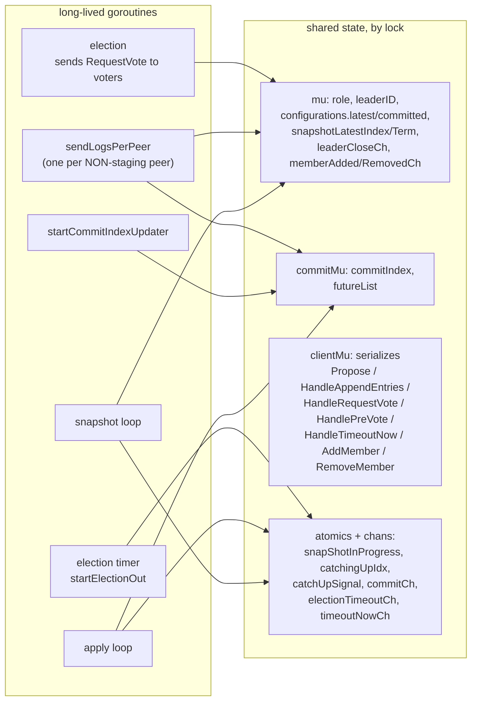
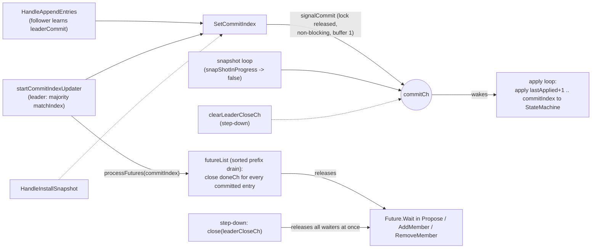
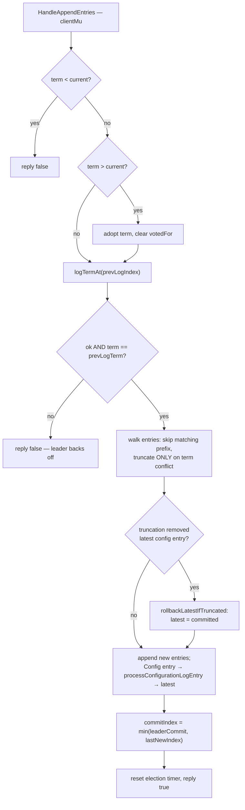
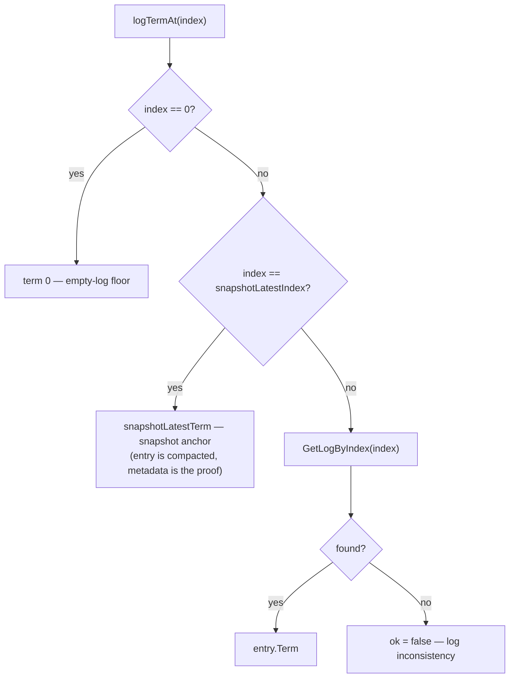
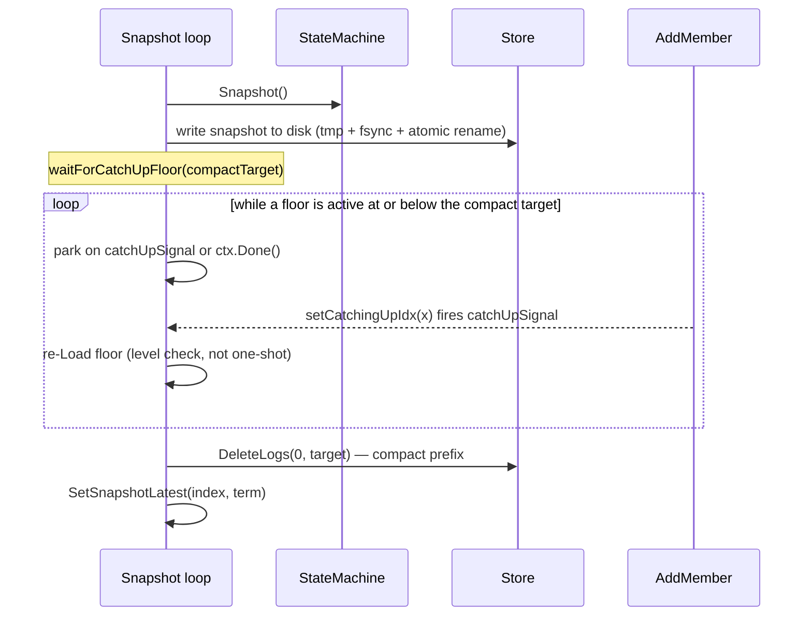

# raft — Architecture & Flow Map

The one place to re-load the whole picture. Each diagram is one lens; the prose
between them says how the lenses connect. Read top to bottom the first time.

Diagrams:
1. [Layering](#1-layering--library-vs-embedding) — library vs. the concrete deployment
2. [Roles](#2-role-state-machine) — Follower / Candidate / Leader lifecycle
3. [Goroutines & shared state](#3-goroutines--shared-state) — what runs, what locks it touches
4. [Waiting for a commit](#4-waiting-for-a-commit--two-mechanisms-not-one) — commitCh and futures
5. [HandleAppendEntries](#5-handleappendentries-follower-side) — the follower's core path
6. [logTermAt](#6-logtermat--the-snapshot-boundary-anchor) — the prevLog anchor
7. [AddMember](#7-addmember-end-to-end) — membership change, end to end
8. [Snapshot + retain floor](#8-snapshot-creation--the-retain-floor-delay) — compaction vs. catch-up

---

## 1. Layering — library vs. embedding

The library (repo root) never touches the network or app state directly. It calls out through three
interfaces the caller implements. Everything else in this doc happens *inside* `raft.Node`.



> Not wired yet: `startSnapshotLoop` isn't started from `Node.Start`, and `example/server` passes `nil`
> as the StateMachine. The snapshot/membership machinery below is built but not running in a real node.

---

## 2. Role state machine

The node is always exactly one role. Transitions are the spine everything else hangs off:
`becomeFollower` starts the election timer, `becomeCandidate` starts an election, `becomeLeader`
starts the heartbeat fan-out.



**Invariant:** only the goroutine that owns a lifecycle ends it. A child (`sendLogs`) that sees a
higher term signals `stepDownCh` and returns; `startSendLogs` cancels the heartbeat context and calls
`becomeFollower` exactly once. Failure always retreats to **Follower** (never an immediate retry).

That rule is why two of the transitions above are drawn as signals. `HandleTimeoutNow` does not call
`becomeCandidate` — it pokes `timeoutNowCh` and the election-timer goroutine campaigns, the same path
a fired ticker takes. `RemoveMember`, after removing this node, pokes `electionTimeoutCh` rather than
calling `becomeFollower`, so `startSendLogs` remains the single owner of ending a term.

**The pre-vote gate** sits in front of `Follower → Candidate`. `election()` probes whether it *could*
win at `currentTerm + 1` before persisting anything; losing is a normal outcome that returns to
Follower having written no term, spent no vote and touched no peer. Everything after the gate is
irreversible in the way that matters — a persisted higher term, fanned out, deposes a healthy leader.

---

## 3. Goroutines & shared state

Three separate mutexes, deliberately not merged. `commitMu` is separate because the apply loop holds
it across every condition check and `futureList` lives behind it — merging would put the RPC surface
behind a lock the loop touches on every iteration. Neither lock is ever taken while holding the other.



**Why `clientMu` wraps whole handlers:** they do multi-step read-modify-write on persistent state
(term, votedFor, log) that isn't transactional. Two concurrent `RequestVote`s could otherwise both
read `votedFor == ""` and both grant — two votes in one term. The lock lives in the library so no
caller can forget it.

**Membership and the peer set.** `configurations.latest` holds every member *including this node*, so
each reader has to be explicit about self: RPC fan-out uses `peerIDs`/`voterPeerIDs` (self excluded),
majority math uses `voterCount`/`isVoter` (self included). `startSendLogs` fixes its peer set when a
term begins and learns about later changes through `memberAddedCh` and the per-peer `memberRemovedCh`
— both live only for the duration of that term, which is why every notification is non-blocking.

---

## 4. Waiting for a commit — two mechanisms, not one

`commitIndex` only ever advances through `SetCommitIndex`. Two different things care, and they are
woken by two different means: the **apply loop** by a signal on `commitCh`, and **proposers** by their
`Future`, which `processFutures` completes by closing a per-entry channel.

`signalCommit` is the only writer to `commitCh`. It is non-blocking and the buffer is 1: the signal is
a level ("state moved, go look"), not a queue, and the loop re-reads `commitIndex` and
`snapShotInProgress` when it wakes.



---

## 5. HandleAppendEntries (follower side)

The busiest handler. Note the §5.3 **conflict-only** truncation (only delete on a real term
mismatch — never blindly) and that the prevLog check goes through `logTermAt` (next section).



---

## 6. logTermAt — the snapshot-boundary anchor

The subtle bit that makes replication survive compaction. After an InstallSnapshot, the leader's
next `prevLogIndex` is the snapshot's last-included index — whose entry is **compacted on both
sides**. `logTermAt` treats that boundary as a valid anchor by reading the cached snapshot term.
Used by the follower (`HandleAppendEntries`) **and** the leader (`sendLogs`, AddMember catch-up).



`snapshotLatestIndex/Term` are set via `SetSnapshotLatest` in two places: the leader on snapshot
creation, and the follower on install.

---

## 7. AddMember end-to-end

The big one. Staging peers are skipped by the heartbeat fan-out — AddMember drives their catch-up
out-of-band, then promotes them into the normal machinery. Any failure rolls back so a wedged
Staging peer can't block future adds.

```mermaid
sequenceDiagram
    autonumber
    participant C as Client
    participant L as Leader (AddMember)
    participant S as Store
    participant N as New member
    participant SL as Snapshot loop

    C->>L: AddMember(peerID, Voter/NonVoter)
    Note over L: clientMu; must be leader; reject if another Staging exists
    L->>S: addPeer(Staging), append full-config entry
    L->>L: future.Wait (commitCh -> processFutures)

    rect rgb(225,238,255)
    Note over L,N: 3. InstallSnapshot the new member
    L->>N: InstallSnapshot(stream file + meta{Index,Term})
    N->>N: Restore SM, compact log, SetSnapshotLatest
    N-->>L: success
    end

    Note over L,SL: setCatchingUpIdx(meta.Index+1) = retain floor UP;<br/>fires catchUpSignal so the snapshot loop delays compaction

    rect rgb(226,245,226)
    Note over L,N: 4. Catch-up rounds, up to maxCatchUpRounds
    loop until member reaches head, or a round beats an election timeout
        L->>S: GetLogs(startIdx .. end)
        Note over L: setCatchingUpIdx(Default) once logs are copied
        L->>N: AppendEntries(prevLog = snapshot / last-sent anchor, entries)
        N->>N: logTermAt accepts the anchor, appends
        N-->>L: success
        L->>L: advance match/next; if the round beat an election timeout, caught up
    end
    end

    alt caught up
        Note over L: 5. Promote
        L->>S: SetPeerState(target), append config
        L->>L: wait commit
    else any failure
        Note over L: Rollback
        L->>S: removePeer, append config
        L->>L: wait commit (best effort)
    end
    Note over L,SL: defer setCatchingUpIdx(Default) = retain floor RELEASED on every exit
    L-->>C: nil / error
```

---

## 8. Snapshot creation & the retain-floor delay

The snapshot loop writes the snapshot, then must compact the log — but a catching-up member may
still need those logs. So compaction is **delayed, not skipped**: it parks on `catchUpSignal` until
the floor clears, then compacts. It parks (channel), it does not spin.



**Two footguns baked into this:** `catchingUpIdx` must be initialised to `DefaultCatchingUpIdx`
(the `atomic.Int64` zero value `0` is a real index, which would pin a floor forever); and the floor
must always change through `setCatchingUpIdx` (store **and** signal) or the loop sleeps forever.

---

## How it all connects, in one breath

`Node.Start` brings up the **election timer**; on timeout the node runs a **pre-vote** round and only
if a majority would vote for it does it become **Candidate** → RequestVote to voters → majority →
**Leader** → **heartbeat fan-out** (one `sendLogsPerPeer` per non-Staging peer). Replication and
`startCommitIndexUpdater` push `commitIndex` up through `SetCommitIndex`, which signals **commitCh** —
waking the **apply loop** (applies to the StateMachine) — and then drains **futureList**, releasing the
`Future` every `Propose`/`AddMember` is waiting on; a step-down instead closes **leaderCloseCh**,
failing all those waiters at once with `ErrLeadershipLost` rather than leaving them parked. When the log grows, the **snapshot loop** captures
state, then compacts — **delaying** compaction via the `catchingUpIdx` retain floor whenever
**AddMember** is catching a new member up. Catch-up and normal replication both survive compaction
because `logTermAt` accepts the **snapshot boundary** as a valid prevLog anchor. Membership lives in
`configurations.latest` (Voter/NonVoter/Staging, **including this node**); only **Voters** count toward
the majorities election and commit use. `AddMember`/`RemoveMember` change it through the normal log,
tell the running fan-out via `memberAddedCh`/`memberRemovedCh`, and — when the leader removes
itself — hand leadership on with **TimeoutNow** before stepping down anyway.
